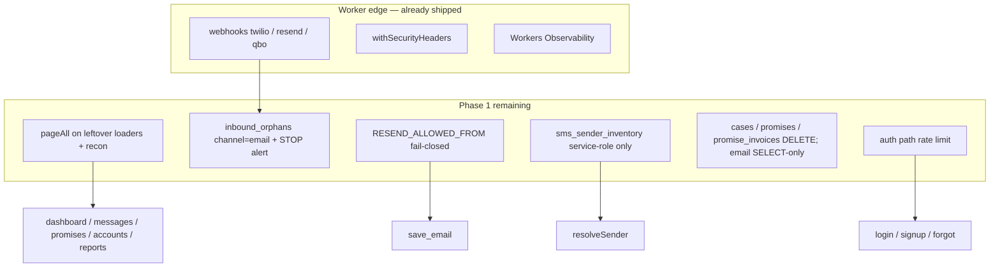
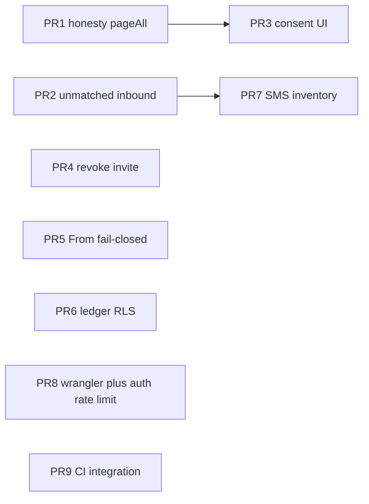

# Phase 1 — Slices A–E: Legal / Ops / Public-SaaS Gate

> **Historical / evidence only (stamped 2026-08-23).** This document is not a
> living roadmap and must not be executed as written. Next SQL is **not**
> `0044` — disk already has `0044_inbound_orphans_email_and_email_norm.sql`
> through `0048_sms_sender_inventory.sql`, plus this stack's
> `0049_cases_and_consent_rls.sql`, `0050_promises_rls.sql`, and
> `0051_message_events_direction.sql`. The remaining-PR list below (auth
> rate limits, `sms_sender_inventory` as a later product, next SQL 0044)
> collided with disk (IQ-9). Auth rate limits were **not** implemented
> (IQ-8). Treat the inventory as evidence of HEAD `4755483` on 2026-08-22.

| Field | Value |
|---|---|
| **Status** | Historical / evidence (not a living roadmap) |
| **Author** | NudgePay engineering |
| **Date** | 2026-08-22 |
| **HEAD** | `4755483` (`feat: complete collections workspace polish (#71)`, 2026-08-22). `origin/main` re-pulled 2026-08-22 — still this SHA. |
| **App** | `nudgepay-app/` (React Router 7.18.2 on Cloudflare Workers + Supabase) |
| **Audit seed** | `docs/production-audit-2026-08-20/` (HEAD then `820fb1ba`, 2026-07-28) |
| **Later ledger** | `docs/audits/2026-08-20-production-readiness/fix-pass-status.md` |
| **Next migration** | Not 0044. Ceiling after this stack is `0051_message_events_direction.sql`. |
| **Out of scope** | Phase 2 UX (shipped #61–#71), Phase 3 automation / scheduled chase, bulk-email API |

---

## Overview

NudgePay is a **human-operated QuickBooks Online collections work queue** with promise-to-pay tracking and two-way SMS plus single-send email. It is not an autopilot AR suite, payment processor, or order-to-cash platform.

The 2026-08-20 production-readiness audit (`docs/production-audit-2026-08-20/00-executive.md`) dual-barred **managed production** and **public SaaS** as NO-GO. Between that freeze (`820fb1ba`) and current `main` (`4755483`), most of Slices A–E shipped in code: CAN-SPAM sentinel, STOP provenance, password reset, `/auth/confirm`, HttpOnly cookies, member offboarding, QBO first-sync + dead-token status, `pageAll`, send-rate caps, security headers, Workers Observability, React Router 7.18.2, CI unit job.

This document is **not** a re-audit of July. It classifies every Slice A–E NP ID against **this HEAD**, then specifies only the **remaining** work an engineer can implement from this file plus `nudgepay-app/` at `4755483`.

Remaining work is honesty, legal completeness, and the public-SaaS gate:

1. **Honesty:** remaining unbounded PostgREST reads still ignore `error` (they destructure `{ data: msgRows }` then coerce `(msgRows as any[]) ?? []`) and do not page. A failed PostgREST call looks empty. Do not grep for `?? []` alone.
2. **Legal leftovers:** unmatched STOP has no ops alert; unmatched inbound email is dropped; consent UI still offers one-click “Mark consented” after `inbound_stop`.
3. **Public-SaaS gate (From allowlist is also managed):** shared Twilio sender, empty From allowlist = allow-all on the shared Resend key (do not enable Chancey email until PR 5 + `RESEND_ALLOWED_FROM`), no auth rate limits, no CI integration job, remaining member DELETE on cases/promises/`promise_invoices`/email ledger.
4. **Ops (non-code):** production secret verification, Intuit portal + Netlify live check, hosted GoTrue redirect allowlist.

**Bulk email remains gated.** Phase 1 may finish the gates that make a later bulk path *possible* (rate limits, verified From, un-wipeable opt-out). It must not ship `api/bulk-email` or a bulk-email product surface.

---

## Background & Motivation

### Product job (non-negotiable)

Collectors work a queue: open case → contact (call / SMS / email) → promise → payment-validated broken detection. Quiet hours, consent, do-not-text, do-not-email, and exception contact-blocks are re-checked **server-side** on every customer send (`sendInvoiceText`, `sendInvoiceEmail`).

Do **not** add: cash application, forecasting, extra ERPs, Slack, hosted payment portal, auto-dunning sequences, or bulk email as a new product surface.

### Why Phase 1 still exists after Phase 2 UX

Phase 2 (`#61`–`#71`) shipped density, peek, workspace invoices, entity toggle, AR KPIs, collision recheck, org-local midnight, email `(org_id, case_id, created_at)` index, paid_date merge. Those are **not** reopened here.

The Aug 20 audit’s **managed** bar was legal/ops: CAN-SPAM wipe, dropped STOP, dead QBO chip, no member removal, Intuit 404s. The **public** bar added password reset, confirm landing, shared Twilio/Resend, 1,000-row truncation, no CI.

Most of that landed in the later fix-pass (`docs/audits/2026-08-20-production-readiness/fix-pass-status.md`). The ledger marks items `code`; it is not a live re-audit. This spec re-read `nudgepay-app/` at `4755483` and disagrees where the ledger is ahead of the remaining gap.

### Pain that is still real on HEAD

- `/messages`, `/promises`, `/accounts`, and `/reports` leftover reads still do `{ data } = await supabase.from(...)` with **no `error` check and no `count: exact`**. A PostgREST failure or a 1,000-row cap looks like an empty inbox / empty promise ledger / $0 accounts — the original NP-2026-015 failure mode, just not on `/dashboard` Stage 1.
- `applyCaseReconciliation` **throws** if the first page is short of `count`, which is fail-closed (good) but does not **page**. Past 1,000 overdue invoice rows, recon hard-fails instead of completing.
- `fromAddressAllowed("", [])` returns `true`. Enabling email with no `RESEND_ALLOWED_FROM` is still free-text From on the shared Resend key (NP-2026-013).
- `resolveSender` ignores `messaging_config` and always returns the env default (NP-2026-012). Correct lock for a shared number; still a public-launch blocker.
- `recordInboundEmail` unmatched → `{ matched: false }` with **no insert**. Resend receiving webhooks often omit body; we never fetch `GET /emails/receiving/:id`.
- Unmatched STOP is in `inbound_orphans` + TwiML, but there is no structured ops alert.
- Settings pending invites are display-only; no revoke.
- Detail panel “Mark consented” after STOP has no reason field and no owner gate in the UI (API does).

---

## Goals & Non-Goals

### Goals

- Close every **still-open** or **partial** Slice A–E item so Chancey (managed, one tenant) can be pointed at production without legal/ops blockers, and so a later public-SaaS launch has the **gates** (not the marketing) in code.
- Keep the human-operated queue. All new behavior is fail-closed, org-scoped, and testable without I/O in pure modules.
- Prefer extending `page-all.ts`, `send-limits.ts`, `sms-gate.ts`, `comm-prefs.ts`, `email-settings.ts`, `twilio-messaging.server.ts`, `email-messaging.server.ts`, `csrf.server.ts`, `security-headers.ts`, `notifications.server.ts`.
- Sequential SQL from **0044**. Secrets stay in wrangler; never hardcode credentials.

### Non-goals

- Phase 3 scheduled chase / autopilot dunning.
- Re-implementing Phase 2 UX (density, peek, AR KPIs, collision, workspace invoices).
- Bulk-email API, route, or UI. Existing `api.bulk-sms` stays; no email analogue.
- Org switcher (single-org unique `memberships.user_id` already shipped as the chosen 017/019 fix).
- Cash application, payment portal, extra ERPs, Slack, forecasting.
- Raising `supabase/config.toml` `max_rows = 1000` as a “fix”.
- Full Content-Security-Policy beyond existing `frame-ancestors 'none'` (headers already ship HSTS/XFO/nosniff/Referrer/Permissions-Policy).
- Sentry (Workers Observability is the chosen NP-2026-042 fix).
- Slice F polish (a11y copper, reduced-motion — already touched in #61; remaining polish is out of Phase 1).

---

## HEAD inventory (`4755483`)

`origin/main` was re-pulled 2026-08-22 and is still `4755483`. Remaining 9-PR work is unchanged: empty From allowlist still allow-all; no `[[ratelimits]]`; no `sms_sender_inventory`; no invite revoke; next SQL still **0044**.

Legend: **Shipped** = do not re-implement (cite files/tests). **Partial** = remaining work below. **Open** = not started. **Ops** = cannot be a code PR.

### Slice A — ship-or-don't (P0-managed)

| ID | Title | Status | Evidence on HEAD |
|---|---|---|---|
| NP-2026-003 | Save prefs wipes `do_not_email` | **Shipped** | `parseCommPrefsUpdate` omits without `do_not_email_set` + `confirm_resubscribe`. `AccountProfile.tsx`, `CommPrefsDrawer.tsx`. Tests: `tests/comm-prefs.test.ts`, `tests/api-comm-prefs.test.ts`. |
| NP-2026-004 | Unmatched STOP dropped HTTP 200 | **Partial** | Persist `inbound_orphans`, apply STOP/START by `phone_last10`, TwiML via `twimlForKeyword`. Tests: `tests/twilio-inbound.test.ts`. **Missing:** ops alert on unmatched STOP. |
| NP-2026-011 | Consent provenance / one-click reverse | **Partial** | Cols in `0035_sms_consent_provenance.sql`. API lock in `api.sms-consent.tsx` (owner + reason ≥ 3 after `inbound_stop`). **Missing:** DetailPanel still one-click; loaders do not pass `sms_consent_source`. |
| NP-2026-008 | Production env never configured | **Ops / partial** | `wrangler.toml` `[env.production.vars] SUPABASE_URL = "https://epjumsnmpvilgasycpau.supabase.co"`, `QBO_SANDBOX=false`, custom domain `nudgepay.9thlevelsoftware.com`. **Missing:** live `wrangler secret list --env production` evidence. |
| NP-2026-009 | Intuit URLs 404 | **Ops / partial** | `netlify/_redirects` 301 `/privacy` `/eula` → Worker. Routes exist. Checklist URLs filled. **Missing:** live curl + Intuit portal submit. |
| NP-2026-005 | OAuth callback never backfills | **Shipped** | `auth.qbo.callback.tsx` `waitUntil(syncOverdueInvoices)`. |
| NP-2026-006 | Dead QBO still Connected | **Shipped** | `getValidAccessToken` refresh failure → `status='error'`. Chrome: “Needs reconnect”. |
| NP-2026-010 | No member removal | **Partial** | `0036_memberships_offboarding.sql` + last-owner trigger. `api.members.tsx` invite/remove/role/leave. Settings roster UI. **Missing:** revoke pending invite. |
| NP-2026-015 | Loader errors look like $0 | **Partial** | `loadCaseQueueSource` Stage 1 throws + `assertNotTruncated`. Root `ErrorBoundary` is not an empty queue. **Missing:** Stage 2 last-contact/promises still `{ data }` only; `/messages` `/promises` `/accounts` `/reports` leftover same. |

### Slice B — account & trust

| ID | Title | Status | Evidence |
|---|---|---|---|
| NP-2026-001 | Password reset | **Shipped** | `forgot-password.tsx` `resetPasswordForEmail`; `reset-password.tsx`; login “Forgot password?”. |
| NP-2026-002 | `/auth/confirm`; signup drops cookies | **Shipped** | `auth.confirm.tsx` `verifyOtp`; signup returns `routerData(..., { headers })`. |
| NP-2026-018 | Invite email | **Shipped** | `invite-email.server.ts`; Settings Workspace invite + copyable link. (CI is **NP-2026-016**, Slice E — different card.) |
| NP-2026-017 / 019 | Org switcher or single-org | **Shipped (guard)** | `0040_one_membership_per_user.sql` unique `memberships.user_id`; `canJoinOrg` / `AlreadyInWorkspaceError`. **No switcher — by design.** |
| NP-2026-020 | Change password / email / delete | **Shipped** | `password-change.ts`, `email-change.ts`, `account-deletion.ts`; Settings forms; last-owner block. |
| NP-2026-021 | Cookie flags | **Shipped** | `supabase.server.ts` `httpOnly: true`, `secure: https`, `sameSite: "lax"`, `maxAge: 14d`. |
| NP-2026-022 | Login CSRF | **Shipped** | `requireSameOrigin` on login/signup/logout. RR upgraded (040). |

### Slice C — messaging legal

| ID | Title | Status | Evidence |
|---|---|---|---|
| STOP persist + TwiML | | **Shipped** | `recordInboundMessage` + `twimlForKeyword`. |
| Consent provenance | | **Partial** | See 011. |
| NP-2026-121 STOP language | | **Shipped** | `ensureStopLanguage` appended at send; `tests/sms-templates.test.ts`. |
| NP-2026-139 HELP/INFO | | **Shipped** | `sms-keywords.ts`; `tests/sms-keywords.test.ts`. |
| NP-2026-033 List-Unsubscribe + postal | | **Shipped** | Headers in `sendInvoiceEmail`; `parseEmailSettingsUpdate` requires postal when enabled; RFC 8058 POST on `/unsubscribe`. |
| NP-2026-014 inbound mapper | | **Partial** | `mapResendEvent` accepts `email.received`; `firstAddr` handles arrays. **Missing:** receiving-API body fetch; persist unmatched. |
| NP-2026-034 failed/suppressed | | **Shipped** | Mapped; `optOut` on suppressed/permanent bounce sets `do_not_email`. |
| NP-2026-141 Resend in privacy/EULA | | **Shipped** | `privacy.tsx` §4b + sub-processors. |

### Slice D — scale / honesty

| ID | Title | Status | Evidence |
|---|---|---|---|
| NP-2026-007 truncation + recon | | **Partial** | Recon uses `count: exact` and **throws** if short — does not page. Stage 1 queue asserts. Peek/AR/payer use `pageAll`. **Missing:** page recon + remaining loaders. |
| Surface `truncated` | | **Partial** | AR KPIs `coverage: "partial"` + `ArKpiBand` “Partial history”. Messages/promises/accounts do not. |
| NP-2026-028 QBO paging | | **Shipped** | `qboQueryAll`; CDC cap does not advance watermark. |
| NP-2026-015 loader errors | | **Partial** | See Slice A. |
| NP-2026-024 email as last-contact | | **Shipped** | Stage 2 selects outbound `email_messages`; `countsAsCustomerContact("email")`. |

### Slice E — public SaaS

| ID | Title | Status | Evidence |
|---|---|---|---|
| NP-2026-012 per-org SMS senders | | **Open** | `resolveSender` returns env default; `save_sms_sender` locked. Correct for shared account. |
| NP-2026-013 verified From | | **Partial** | Unique index on enabled `from_address` (`0035`). `RESEND_ALLOWED_FROM` parsed in `save_email`. **Empty allowlist allows all.** |
| NP-2026-035 rate limits | | **Partial** | SMS/email/test caps + Idempotency-Key (`send-limits.ts` / `.server.ts`). **No** login/signup/forgot/invite app-level cap. |
| NP-2026-016 CI + `.env.test.example` | | **Partial** | `.github/workflows/ci.yml` typecheck + `test:unit`. `.env.test.example` exists. **No** `supabase start` integration job. |
| NP-2026-040 RR ≥ 7.12 | | **Shipped** | `react-router@7.18.2`; `tests/react-router-advisory.test.ts`. |
| NP-2026-039 security headers | | **Shipped** | `security-headers.ts` applied in `workers/app.ts`. |
| NP-2026-042 monitoring | | **Shipped** | `[observability]` in wrangler; `worker-observability.ts`. |
| NP-2026-036 member RLS on audit | | **Partial** | `0038` contact_logs/text_messages insert+select; invite token columns revoked; QBO ciphertext revoked. Invites already owner-write (`0032` `invites_owner_write`). **Still member FOR ALL:** `collection_cases`, `promises`, `promise_invoices`. `email_messages` owner `FOR ALL` includes DELETE. |

### Intentionally not remaining (do not reopen)

CSRF on authenticated mutations, webhook signatures, QBO token crypto, `safeReturnTo`, unsubscribe HMAC GET-vs-POST, promise machine, `listOrgMembers` as the single label source, send-path gating (quiet hours / consent / DNC), FirstRunBanner / SyncIssues, virtual window, Focus collision API, US/USD CompanyInfo gate, CDC time budget + checkpoints.

---

## Key Decisions

1. **Single-org guard, not an org switcher.** `0040` unique `memberships.user_id` + `canJoinOrg` is the 017/019 fix. A switcher is a v2 product. Do not add a second membership path.

2. **Shared Twilio sender stays locked until an operator-provisioned inventory exists.** Tenants must never write `messaging_config.sender` / `messaging_service_sid` through `save_sms_sender`. Public SaaS adds `sms_sender_inventory` written only by service_role / ops SQL. The only env flag is **`SMS_REQUIRE_INVENTORY`** (`"true"` / unset). Unset/false (Chancey/dev): missing inventory row falls back to the Worker env default sender. `"true"` (public multi-tenant): missing/disabled inventory throws and send is blocked.

3. **Empty From allowlist is fail-closed when enabling email.** `fromAddressAllowed` currently returns `true` if `allowlist.length === 0`. Change to `false`. Local/dev must set `RESEND_ALLOWED_FROM` in `.dev.vars` (or `save_email` will reject enable). Production var is the operator-verified set. **Managed Chancey must not enable email until this lands and the var is set** — free-text From on the shared Resend key is a CAN-SPAM/impersonation issue for one tenant too.

4. **Page, then decide — never treat a truncated set as complete.** Recon must `pageAll` overdue invoices and open cases, then set-difference. If still truncated at `PAGE_ALL_MAX_ROWS` (5000), **throw**. `applyPaymentsAndEvaluate` in `qbo-sync.server.ts` currently **swallows** recon errors (`console.error` only), so CDC still stamps `last_cdc_time`. PR 1 must `recordSyncError` **and rethrow** so `runCdcCatchup` does not advance the watermark. Loaders page, throw on `error`, and pass `truncated` to a banner (do not render as $0 / empty-healthy).

5. **Unmatched inbound is a ledger event, not a 200-and-forget.** SMS already inserts `inbound_orphans`. Email must too (same table, `channel` discriminator). STOP orphans emit a structured `console.error` (`event: "inbound_orphan_stop"`) so Workers Logs alert. **No operator email in Phase 1** — `sendEmail` needs a From/`EmailConfig` that `recordInboundMessage` does not have; do not 500 the webhook for an optional alert.

6. **Inbound STOP remains irreversible from the member UI.** API already requires owner + reason ≥ 3. UI must hide “Mark consented” for members when `sms_consent_source === "inbound_stop"` and require the reason field for owners. Do not train staff “not to click it”.

7. **No bulk-email route in Phase 1.** Single-send is already capped (`EMAIL_ORG_HOUR_CAP = 120` / hour, `EMAIL_CUSTOMER_DAY_CAP = 8` / day) and opt-out needs `confirm_resubscribe`. That is the bulk-email *gate*, not the product.

8. **Extend `pageAll` / `pageAllChunked`; do not raise `max_rows`.** `supabase/config.toml` stays at 1000.

9. **Ledger writes stay as tight as the app actually uses.** Members: SELECT+INSERT+UPDATE on `collection_cases` / `promises` / `promise_invoices` (workflow). Owner DELETE on cases/promises/promise_invoices. **`email_messages`: authenticated SELECT only** — no INSERT/UPDATE/DELETE for member *or* owner JWT; service_role continues to write (all app sends/inbound already use the service client). Contact logs / SMS ledger stay as `0038` (member insert+select; owner update/delete).

10. **Ops work is a runbook, not a fake PR.** Secrets, Intuit portal, Netlify deploy, GoTrue `site_url`, A2P brand, Resend domain verify, anon-key rotation.

### Resolved questions (2026-08-22)

These were Open Questions; they are now final. They pin PRs 2, 7, 8, and 9 without changing the PR graph.

11. **Auth rate limits (PR 8):** Fail-closed in production if the Cloudflare Rate Limiting binding is missing, unless `AUTH_RATE_LIMIT_WAF=true` (only when WAF evidence exists on `/login` `/signup` `/forgot-password`). Do not silent-no-op in production. Do not drop PR 8. Wrangler must declare **both** top-level and `[[env.production.ratelimits]]`.

12. **Resend receiving API (PR 2):** Implement against current public docs (`body = text || html || ""`, `AbortSignal.timeout(5000)`). Adjust if the first live `email.received` event differs. Do not block PR 2 on a live fixture.

13. **`SMS_REQUIRE_INVENTORY` (PR 7):** Leave unset/false until a second tenant exists. Chancey stays on the operator Messaging Service fallback. The `sms_sender_inventory` table still ships in PR 7.

14. **CI integration job (PR 9):** Land with `on: push` to `main` + `schedule: "0 8 * * *"` + `workflow_dispatch`. Job `if: github.event_name != 'pull_request'`. **Do not add PR coverage in this phase** (even after the first `main` run is under ~8 min — that is a later change). Do not make it nightly-only.

---

## Proposed Design

### Architecture (remaining)



### Slice D remaining — honest lists

**Problem.** `page-all.ts` is the right primitive and is used by peek, AR KPIs, payer, contact-promise rates, and reports’ AR path. These loaders still do a single unbounded select and ignore `error`: they destructure `{ data: msgRows }` then `(msgRows as any[]) ?? []`. A failed PostgREST call looks empty. `pageAll`’s own `data ?? []` after an error check is fine and is **not** the anti-pattern.

| Loader | File | Selects |
|---|---|---|
| Messages | `app/routes/messages.tsx` | `text_messages`, `email_messages`, then `.in(id)` customers/cases/invoices |
| Promises | `app/routes/promises.tsx` | `promises`, customers, cases, `promise_invoices`, invoices |
| Accounts | `app/routes/accounts.tsx` | **all** `customers`, open invoices, **all** `collection_cases` |
| Reports leftover | `app/lib/reports.server.ts` | `contact_logs`, `promises` (resolved window), opened cases, open cases, invoices by customer |
| Queue Stage 2 | `app/lib/case-queue.server.ts` | contact_logs / text_messages / email_messages / promises `.in(caseIds)` — `{ data }` only |
| Recon | `app/lib/case-lifecycle.server.ts` | first page of overdue invoices + open cases, throw if short |
| Inbound email org map | `email-messaging.server.ts` `recordInboundEmail` | **all** `email_config` (see 0044 `from_address_norm`); customers via `email_norm` |
| Digest/CDC org list | `digest-cron.server.ts`, `qbo-cron.server.ts` | all `qbo_connections` `status=connected` (tiny; page anyway) |
| Holidays | `org-config.server.ts` | `org_holidays` (tiny; throw on error — already throws) |

**Contract — `page-all.ts` (pure):** reuse existing `PageAllResult<T>` (do **not** add `LoaderPage`). `pageAll` already `throw error` on PostgREST failure (raw object; `tests/page-all.test.ts`). Do **not** add `throwIfQueryError`. Non-`pageAll` arms use `if (res.error) throw res.error` (Stage 1 already does this for `invRes` / `caseRes` / `mcfgRes`).

Update the file-level comment: today it says `pageAll` must **not** page Stage-1 of `loadCaseQueueSource`. PR 1 reverses that — Stage 1 **does** use `pageAll`.

Do **not** add I/O to `page-all.ts`. Callers of a simple table:

```ts
const page = await pageAll<MsgRow>(
  (from, to) => orderPage(
    supabase.from("text_messages")
      .select("customer_id, direction, body, status, error_code, invoice_id, created_at, id", { count: "exact" })
      .eq("org_id", org.org_id)
      .not("customer_id", "is", null)
      .range(from, to),
  ),
);
const truncated = page.truncated;
```

`.in(id)` fan-out must use existing `chunkIds` + `pageAllChunked` (same pattern as `activity-peek.server.ts`).

**Recon (`applyCaseReconciliation` + caller):**

1. `pageAll` overdue `customer_id` with `{ count: "exact" }`, filter `balance > 0`, `due_date < today`. Invoices have no embed, so `orderPage` is unambiguous.
2. `pageAll` open cases `id, customer_id`.
3. If either `truncated`, `throw new Error("reconciliation truncated: ...")`. Do not resolve.
4. Then existing `reconcileCases(overdueCustomerIds, openCases, today)` set-difference — now on a **complete** set or not at all.

**Caller (HEAD bug, PR 1 must fix):** `applyCaseReconciliation` is only invoked from `applyPaymentsAndEvaluate` (`qbo-sync.server.ts` ~145–146):

```ts
try { await applyCaseReconciliation(deps.service, orgId, today); }
catch (e) { console.error("[6b] reconciliation failed (payments)", e); }
```

That catch does **not** rethrow and does **not** call `recordSyncError`. `runCdcCatchup` then stamps `last_cdc_time` because it only rethrows when `applyPaymentsAndEvaluate` itself throws. Change the catch to:

```ts
try {
  await applyCaseReconciliation(deps.service, orgId, today);
} catch (e) {
  console.error("[6b] reconciliation failed (payments)", e);
  await recordSyncError(deps.service, {
    orgId,
    source: deps.errorSource ?? "cron",
    scope: "recon",
    message: e instanceof Error ? e.message : String(e),
  }).catch((err) => console.error("[6b] recordSyncError failed", err));
  throw e;
}
```

Add optional `errorSource?: "manual" | "webhook" | "cron"` to `SyncDeps`. Callers: CDC `"cron"`, `auth.qbo.callback` / refresh `"manual"`, QBO webhook `"webhook"`. Import `recordSyncError` from `sync-errors.server.ts` (not currently imported in `qbo-sync.server.ts`).

Do not resolve from a truncated set. Do not raise `max_rows`.

**Stage 1 queue:** replace `assertNotTruncated` on a single page with `pageAll` of invoices and cases (keep `count: exact`). If truncated at `PAGE_ALL_MAX_ROWS`, throw (dashboard must not silently drop case 1001). Chancey-scale (125–175 overdue) is one extra page at most.

**Do not `orderPage` the current embedded invoice select.** Stage 1 uses `customers!invoices_org_customer_fk(...)`. `orderPage` always `.order("created_at").order("id")` with no table qualifier (`page-all.ts`); both `invoices` and `customers` have `created_at`, so PostgREST will reject or mis-order. **Split:**

1. `pageAll` invoices **without** the embed (`orderPage` on `invoices` is unambiguous).
2. `pageAllChunked` customers by the invoice `customer_id`s (same columns the embed returned: `name, phone, email, owner, sms_consent, preferred_channel, do_not_call, do_not_text`).
3. Join in process (same shape `InvoiceInput` / `CustomerInput` as today).

**Stage 2 queue:** check `error` on every Promise.all arm (except presence, which already degrades). Page with `pageAllChunked` over `caseIds`. If truncated, return `lastContactTruncated: true` and still throw? **Decision:** truncated last-contact is a **banner**, not a $0 queue — the case list from Stage 1 is the source of KPIs. Pass `lastContactTruncated` into dashboard/focus chrome.

**UI — truncation banner (new, small, in `app/components/ui.tsx` or a 10-line `TruncationBanner.tsx`):**

- `role="status"`; copy: “This list is incomplete (over 5,000 rows). Totals may under-count.”
- Use semantic tokens only (`text-warm` / `border-warm`). Not copper (brand).
- Mount on messages / promises / accounts / reports when `truncated`.
- Wire `truncated` into `MessagesMetrics`, `PromisesMetrics`, `AccountsMetrics`, and `reports.tsx` so totals are `"—"` / null (mirror `ArKpiBand` `coverage: "partial"`). Do not present a healthy total on a truncated list.
- Dashboard already has AR “Partial history”; add the same for `lastContactTruncated` on the work queue metrics strip.

**Loader errors:** never treat a failed select as empty. `pageAll` already throws. Root `ErrorBoundary` (`app/root.tsx`) stays the fail-loud UI — it already says “Something went wrong”, not $0. Do not add a per-route fake empty state.

**Inbound email lookups (0044) — do not page whole tables:**

```sql
alter table customers
  add column if not exists email_norm text
    generated always as (lower(btrim(email))) stored;
create index if not exists customers_email_norm_idx
  on customers (org_id, email_norm)
  where email_norm is not null;

alter table email_config
  add column if not exists from_address_norm text
    generated always as (lower(btrim(from_address))) stored;
```

(The unique index `email_config_from_address_unique` on `lower(from_address)` WHERE enabled already exists in 0035.)

Customer: `.eq("org_id", orgId).eq("email_norm", fromNorm).limit(2)` — 0 = unmatched orphan, 1 = match, 2 = ambiguous (orphan + log).

Org: **do not** `select` all `email_config`. Query the unique key:

```ts
const { data: configs, error } = await service.from("email_config")
  .select("org_id, from_address")
  .eq("from_address_norm", toNorm)
  .eq("email_enabled", true)
  .limit(2);
```

0 = unmatched, 1 = org, 2 = ambiguous (treat as unmatched + log; unique index should prevent this).

**Tests (names):**

- `tests/page-all.test.ts` — existing; no new helper type. Reverse the “must not page Stage 1” comment; add a case that `orderPage` is only used on non-embedded queries.
- `tests/cases-rls.test.ts` (integration, already imports `applyCaseReconciliation`) **or** a mocked `tests/qbo-sync.test.ts` / `tests/qbo-sync-cdc.test.ts`: 1001 overdue invoices pages instead of throw-on-first-page; a thrown recon error does **not** stamp `last_cdc_time`. Do **not** put I/O recon tests in pure `tests/cases.test.ts`.
- `tests/assumed-scope-contracts.test.ts` (extend): fail if a listed file contains `{ data:` (including `{ data: logRows }` and Promise.all array arms `[{ data: logRows }, { data: msgRows }, ...]`) **without** `error` on that same destructure. Stage 2 on HEAD is `const [{ data: logRows }, { data: msgRows }, ...] = await Promise.all([` — a grep for only `const { data:` **misses it**. Pin Stage 2 to named `{ data, error }` per arm **or** `pageAllChunked` (which throws). Files: `messages.tsx`, `promises.tsx`, `accounts.tsx`, `reports.server.ts`, `case-queue.server.ts`. Do **not** grep for `?? []`.
- `tests/message-inbox.test.ts` — if a truncated flag is plumbed through a pure builder, assert metrics go to `"—"`.

### Slice A/C remaining — unmatched inbound + consent UI + invite revoke

#### Unmatched STOP ops alert

After `persistOrphan` when `keyword === "stop"`:

```ts
console.error({
  event: "inbound_orphan_stop",
  from: args.from,
  to: args.to,
  sid: args.messageSid,
});
```

Workers Observability already indexes JSON fields (`worker-observability.ts` pattern). Inject `onOrphanStop?: (info) => void` on `recordInboundMessage` for tests; default `console.error`. Do **not** send operator email from this path (`sendEmail` requires `from` + `EmailConfig`; missing secrets must not 500 the webhook). `alreadyRecordedInbound` returns before persist, so Twilio retries will not re-log.

Webhook still 200 + TwiML. Do not 500 after persist. On unique violation `23505`, treat as success (same as SMS `persistOrphan` today).

#### Unmatched inbound email + receiving body

HEAD `0035` defines `inbound_orphans.from_number text not null` and `to_number text not null`. Adding email columns without relaxing those constraints makes `channel='email'` inserts fail `23502` and the webhook 500-retry — worse than today’s silent `{ matched: false }`.

Migration **0044** (full):

```sql
alter table inbound_orphans
  add column if not exists channel text not null default 'sms'
    check (channel in ('sms', 'email')),
  add column if not exists from_address text,
  add column if not exists to_address text,
  add column if not exists subject text,
  add column if not exists provider_message_id text;

alter table inbound_orphans alter column from_number drop not null;
alter table inbound_orphans alter column to_number drop not null;

alter table inbound_orphans drop constraint if exists inbound_orphans_address_present;
alter table inbound_orphans add constraint inbound_orphans_address_present check (
  (channel = 'sms' and from_number is not null and to_number is not null)
  or
  (channel = 'email' and from_address is not null and to_address is not null)
);

create unique index if not exists inbound_orphans_provider_message_id_key
  on inbound_orphans (provider_message_id)
  where provider_message_id is not null;

-- customers.email_norm + email_config.from_address_norm as above
```

Email unmatched insert: `channel='email'`, `from_address` / `to_address` set, `from_number` / `to_number` null, `provider_message_id` set. On `23505`, return `{ matched: false }` and still **204** (idempotent retry). `console.error({ event: "inbound_orphan_email", ... })`.

**Body fetch** — extend `app/lib/email-client.server.ts` (file + tests already exist):

```ts
export async function fetchReceivingEmail(
  fetchFn: typeof fetch,
  cfg: EmailConfig,
  receivingId: string,
  signal?: AbortSignal,
): Promise<{ text: string; html: string; from: string; to: string; subject: string } | null>
```

`GET https://api.resend.com/emails/receiving/{id}` with Bearer key. Pass `AbortSignal.timeout(5000)` (or `signal ?? AbortSignal.timeout(5000)`). 404 → null. Abort / non-2xx → throw (webhook 500 so Resend retries).

Map body as `text || html || ""` (Resend often has `text: null` and HTML only; do not strip-require a sanitizer — store the HTML string if text is empty, same as `mapResendEvent` already does with `str(d.text) || str(d.html)`).

`webhooks.resend.tsx`: on inbound, **always** fetch when `providerMessageId` is present (webhook payloads omit body). Then `recordInboundEmail` with `body = fetched.text || fetched.html || mapped.body`. Do not block PR 2 on a live fixture (Key Decision 12); adjust if the first live `email.received` event differs.

Tests: `tests/email-events.test.ts` (payload shape — already), `tests/email-inbound-status.test.ts` unmatched insert + 23505 still 204, **extend** `tests/email-client.test.ts` for receiving GET / 404 / abort.

#### Consent UI lock (011 remainder)

HEAD: `DetailPanel` is still one-click (no reason field). `MessageThreadPanel` already posts a `required` reason for **every** unconsented mark, not only `inbound_stop`. Focus has **no** consent toggle. `accounts.$id.tsx` has comm-prefs / `AccountProfile`, not “Mark consented”.

Load `sms_consent_source` only where the toggle is rendered:

- `dashboard.tsx` selected-customer select → `DetailPanel`
- `messages.tsx` customer select → `MessageThreadPanel`

Pass into `DetailPanel` and `MessageThreadPanel` only:

```ts
smsConsentSource: "inbound_stop" | "inbound_start" | "staff" | "import" | "unknown" | null
isOwner: boolean
```

UI rules:

| State | Member | Owner |
|---|---|---|
| `inbound_stop` and not consented | Static copy: “Stopped by inbound STOP. Owner override required.” No button. | Form with required `reason` minLength 3 + submit “Override STOP” |
| any other not-consented | Existing “Mark consented” | same |
| consented | Revoke (existing) | same |

API already returns `sms=consent_locked`. Surface that flash in both panels (`flash-copy.ts` if a key exists; add `consent_locked` copy). `MessageThreadPanel` should require `reason` **only** when `smsConsentSource === "inbound_stop"` (today it requires reason for all unconsented marks — tighten, don’t loosen the STOP case).

Tests: extend `tests/assumed-scope-contracts.test.ts` (already pins the DetailPanel sms-consent form) to assert: when rendering the STOP-locked branch, the member path has no “Mark consented” submit and the owner path includes `name="reason"`. API lock tests can stay in `tests/api-sms-consent.test.ts` if adding owner/reason cases; that file on HEAD is RLS toggle only — the remaining 011 work is the UI.

#### Revoke pending invite (010 remainder)

`api.members.tsx` new intent:

```ts
if (intent === "revoke") {
  if (org.role !== "owner") return redirect(flag(returnTo, "error", "forbidden"), { headers });
  const inviteId = String(form.get("inviteId") ?? "");
  if (!inviteId) return redirect(flag(returnTo, "error", "invite"), { headers });
  const { error } = await service.from("invites")
    .delete().eq("org_id", org.org_id).eq("id", inviteId).is("accepted_at", null);
  ...
}
```

Settings pending list: each row is a real `POST` form (`intent=revoke`, `inviteId`, `returnTo`) wrapped with **`useTwoStep`** — same pattern as `TemplateEditor.tsx` delete (idle `type="button"` arms; confirm is `type="submit"`). Do **not** nest a submit inside `TwoStepConfirm` (`onConfirm: () => void` + `type="button"` will not POST). `fetcher.submit` is an acceptable alternative; `window.confirm` is not. Unique pending `(org_id, email)` already exists (`0036` / `invites_pending_email_idx`).

Invites are **already owner-write** (`0032` dropped `invites_write` and created `invites_owner_write`). Do not add a migration “to tighten invites” — it is done. The action keeps using the service client.

Tests: owner deletes pending; member cannot via the action; accepted invite not deleted. Extend `tests/org-membership.test.ts` or `tests/invite-email.test.ts`.

### Slice E remaining — public-SaaS gates

#### Fail-closed From allowlist (013 remainder)

`app/lib/email-settings.ts`:

```ts
export function fromAddressAllowed(fromAddress: string, allowlist: string[]): boolean {
  if (allowlist.length === 0) return false;
  return allowlist.includes(fromAddress.trim().toLowerCase());
}
```

`parseEmailSettingsUpdate` already rejects `from_allowlist` when enabled and not allowed. Disabled + empty From still OK (email defaults off).

`save_email` already reads `context.cloudflare.env.RESEND_ALLOWED_FROM`. `getEmailEnv` does **not** require it. Document the var in **`email-settings.ts` comments only** (PR 5 does **not** edit `env.server.ts` or `wrangler.toml`). PR 8 may add a production-vars comment in wrangler when it already owns that file.

Production must set `RESEND_ALLOWED_FROM` to the verified address(es), comma-separated, lowercase, **before** enabling email.

Unique index `email_config_from_address_unique` already prevents two enabled orgs sharing a From.

Tests: `tests/email-settings.test.ts` — empty allowlist + `email_enabled=true` → `{ ok: false, error: "from_allowlist" }`. The existing `"accepts a valid from address"` test **must** pass `["billing@x.com"]` as the allowlist (it currently relies on empty = allow). Same for `emailConfigUpsertRow` helper in that file and `tests/save-email.action.test.ts` if it assumes empty = allow.

**Managed Chancey:** operator sets one verified domain in Resend and one `RESEND_ALLOWED_FROM` entry. No Resend Domains API client in Phase 1. **Do not enable workspace email until PR 5 + the var.**

#### Per-org SMS sender inventory (012)

New migration **0045** `sms_sender_inventory`:

```sql
create table sms_sender_inventory (
  org_id uuid primary key references organizations(id) on delete cascade,
  messaging_service_sid text,
  from_number text,
  from_number_last10 text generated always as (public.phone_last10(from_number)) stored,
  status text not null default 'active'
    check (status in ('active', 'pending', 'disabled')),
  created_at timestamptz not null default now(),
  updated_at timestamptz not null default now(),
  constraint sms_sender_inventory_sender_present
    check (messaging_service_sid is not null or from_number is not null)
);
create unique index sms_sender_inventory_from_number_key
  on sms_sender_inventory (from_number) where from_number is not null;
create unique index sms_sender_inventory_from_number_last10_key
  on sms_sender_inventory (from_number_last10) where from_number_last10 is not null;
create unique index sms_sender_inventory_messaging_service_sid_key
  on sms_sender_inventory (messaging_service_sid) where messaging_service_sid is not null;

alter table sms_sender_inventory enable row level security;
create policy sms_sender_inventory_member_read on sms_sender_inventory
  for select using (public.is_org_member(org_id));
grant select on sms_sender_inventory to authenticated;
grant select, insert, update, delete on sms_sender_inventory to service_role;
-- no authenticated INSERT/UPDATE/DELETE
```

`resolveSender` stays env-free (tests pass a fake client). Thread the flag through deps — HEAD callers are only `sendInvoiceText` (`twilio-messaging.server.ts:137`) and `sendTestSms` (`test-message.server.ts:31`), both `resolveSender(service, orgId, defaultSender)` with no fourth argument. Without this wiring, `SMS_REQUIRE_INVENTORY=true` is a dead flag.

```ts
export type MessagingDeps = {
  /* existing fields */
  requireInventory?: boolean;
};

export type TestSmsDeps = {
  /* existing fields */
  requireInventory?: boolean;
};

export async function resolveSender(
  service: SupabaseClient, orgId: string, defaultSender: TwilioSender,
  opts?: { requireInventory?: boolean },
): Promise<TwilioSender> {
  const { data, error } = await service.from("sms_sender_inventory")
    .select("messaging_service_sid, from_number, status")
    .eq("org_id", orgId).maybeSingle();
  if (error) throw error;
  if (data && data.status === "active") {
    if (data.messaging_service_sid) return { messagingServiceSid: data.messaging_service_sid };
    if (data.from_number) return { from: data.from_number };
  }
  if (opts?.requireInventory) throw new Error("SMS sender not provisioned");
  return defaultSender;
}

// sendInvoiceText:
const sender = await resolveSender(deps.service, args.orgId, deps.defaultSender, {
  requireInventory: deps.requireInventory,
});
// sendTestSms: same
```

`env.server.ts` (PR 7 owns this file):

```ts
export function smsRequireInventory(env: Record<string, string | undefined>): boolean {
  return env.SMS_REQUIRE_INVENTORY === "true";
}
```

Unset = false (Chancey/dev env fallback). **Do not** import `env.server.ts` from `resolveSender`. Route constructors pass the boolean:

| Route | Deps literal |
|---|---|
| `api.text.send.tsx` | `MessagingDeps.requireInventory` |
| `api.bulk-sms.tsx` | same (`runBulkSms` already threads `MessagingDeps`) |
| `api.test-message.tsx` | `TestSmsDeps.requireInventory` |

PR 7 does **not** edit `wrangler.toml`; PR 8 may document the var in a comment when it already owns that file.

`save_sms_sender` stays locked (`api.org-settings.tsx`). Settings UI already says sender is operator-managed — keep copy; show inventory From/SID as read-only if the select returns a row.

**Inbound routing — exact SELECT and precedence:**

```ts
const toNorm = normalizePhone(args.to);
const { data: hits, error } = await service.from("sms_sender_inventory")
  .select("org_id")
  .eq("status", "active")
  .eq("from_number_last10", toNorm)
  .limit(2);
```

| Hits | Action |
|---|---|
| 1 | That `org_id` — skip outbound-history |
| 0 | Existing `resolveInboundOrgId` (outbound `text_messages` last-10 + from_number_norm) |
| 2 | Unique indexes should prevent; treat as unmatched + persist orphan |

If inventory has **only** `messaging_service_sid` (`from_number` null), To-match cannot run (Messaging Service inbound `To` is still a phone). Ops SQL should store the long-code/TFN in `from_number` even when outbound uses the SID. History fallback covers Chancey until then.

Tests: `tests/twilio-send.test.ts` today expects env default even with `messaging_config` SID — **update** to: inventory row wins; `messaging_config` still ignored; missing inventory + `requireInventory` throw. `tests/twilio-inbound.test.ts` To-based route when inventory present. **PR 7 also truncates `sms_sender_inventory` in `tests/global-setup.ts`.**

Ops: insert inventory row via Studio/SQL for each public tenant after A2P campaign approval. Document in runbook. Unique indexes will reject a shared From.

#### Member RLS remainder (036)

Migration **0046**:

```sql
-- collection_cases: members read/insert/update; owner delete
drop policy if exists collection_cases_all on collection_cases;
create policy collection_cases_member_read on collection_cases
  for select using (public.is_org_member(org_id));
create policy collection_cases_member_insert on collection_cases
  for insert with check (public.is_org_member(org_id));
create policy collection_cases_member_update on collection_cases
  for update using (public.is_org_member(org_id)) with check (public.is_org_member(org_id));
create policy collection_cases_owner_delete on collection_cases
  for delete using (public.is_org_owner(org_id));

-- promises: same (cancel is UPDATE status)
drop policy if exists promises_all on promises;
-- (mirror four policies: member select/insert/update, owner delete)

-- promise_invoices: member SELECT/INSERT (create promise writes links);
-- no authenticated DELETE (desyncs the ledger); owner DELETE ok
drop policy if exists promise_invoices_all on promise_invoices;
create policy promise_invoices_member_read on promise_invoices
  for select using (public.is_org_member(org_id));
create policy promise_invoices_member_insert on promise_invoices
  for insert with check (public.is_org_member(org_id));
create policy promise_invoices_owner_delete on promise_invoices
  for delete using (public.is_org_owner(org_id));

-- email_messages: authenticated SELECT only. App writes are service_role
-- (sendInvoiceEmail, recordInboundEmail, test-message). Do NOT add
-- email_messages_member_insert — a member JWT could forge the ledger.
drop policy if exists email_messages_owner_write on email_messages;
-- keep email_messages_member_read (SELECT)
```

`contact_logs` / `text_messages` already insert+select for members (`0038`). Do not reopen. Invites already owner-write (`0032`).

Tests: `tests/cases-rls.test.ts` — member cannot DELETE a case; can UPDATE next_action. `tests/promise-evaluation-rls.test.ts` — member cannot DELETE promise or `promise_invoices` row. `tests/email-messages.rls.test.ts` — **member and owner** cannot INSERT or DELETE email rows via the user client.

#### Auth rate limits (035 remainder)

Send-path caps stay. Add a Cloudflare Rate Limiting binding for unauthenticated POSTs. Wrangler **ratelimits are not inherited** — the repo already duplicates `observability` / `routes` under `[env.production]` for this reason. PR 8 is the **sole** `wrangler.toml` owner.

```toml
# Top-level (dev / default env). namespace_id is a positive integer unique
# per account (Cloudflare examples use 1001 — not limited to 1–255).
[[ratelimits]]
name = "AUTH_RATE_LIMIT"
namespace_id = "1001"
simple = { limit = 20, period = 60 }

[[env.production.ratelimits]]
name = "AUTH_RATE_LIMIT"
namespace_id = "1001"
simple = { limit = 20, period = 60 }
```

Also in this same PR, comment-only in wrangler (not bindings): `RESEND_ALLOWED_FROM`, `SMS_REQUIRE_INVENTORY`. Run `npm run typegen` so `worker-configuration.d.ts` includes `AUTH_RATE_LIMIT`.

Helper `app/lib/auth-rate-limit.server.ts`:

```ts
export type AuthRateLimitEnv = {
  AUTH_RATE_LIMIT?: { limit: (p: { key: string }) => Promise<{ success: boolean }> };
  QBO_SANDBOX?: string;
  AUTH_RATE_LIMIT_WAF?: string;
};

/** true = reject this attempt. Never throw a raw Response (breaks PublicLayout). */
export async function authRateLimited(env: AuthRateLimitEnv, key: string): Promise<boolean> {
  if (env.AUTH_RATE_LIMIT) {
    const { success } = await env.AUTH_RATE_LIMIT.limit({ key });
    return !success;
  }
  // Production without a binding must not silently unlimited-login.
  // WAF substitute: set AUTH_RATE_LIMIT_WAF=true after runbook evidence.
  if (env.QBO_SANDBOX === "false" && env.AUTH_RATE_LIMIT_WAF !== "true") {
    console.error({ event: "auth_rate_limit_unbound" });
    return true;
  }
  return false; // local/dev
}
```

Call from `login.tsx`, `signup.tsx`, `forgot-password.tsx` **after** `requireSameOrigin`, **before** GoTrue. Key = `CF-Connecting-IP` or first `x-forwarded-for` hop.

On limit: **do not** `throw new Response`. Return action data so `useActionData` still renders `PublicLayout`:

```ts
return data(
  { error: humanAuthError("email rate limit exceeded") },
  { status: 429 },
);
```

Same generic copy as GoTrue’s too-many map (`auth-errors.ts` `TOO_MANY`). Login must not leak whether the email exists.

Invite POST is authenticated + owner-only; existing send-limits are enough. Presence heartbeat is authenticated; skip.

Tests: `tests/auth-rate-limit.test.ts` — limiter `{ success: false }` → 429 action data with generic error (not a raw body); missing limiter + `QBO_SANDBOX=true` allows; missing limiter + `QBO_SANDBOX=false` without WAF flag rejects.

#### CI integration job (016 remainder)

Unit job stays independent (already a sibling job; no `if: success() || failure()`). Do not require Docker for `npm run test:unit`.

`.env.test.example` already contains the published local-demo JWT keys that `npx supabase start` uses — **copy it**; do not parse `supabase status`. `tests/global-setup.ts` + `vitest.config.ts` `fileParallelism: false` already serialize the shared DB.

Paste into `.github/workflows/ci.yml` (alongside the existing `unit` job). HEAD `on:` is only `pull_request` and `push: [main]` — **extend it** or nightly / `workflow_dispatch` never fire. **Do not promise 3–6 min.** **Do not add PR coverage for `integration` in this phase** (Key Decision 14). The job `if:` skips PRs; `unit` still runs on PRs. After the first `main` run is under ~8 min, a later change may add `pull_request` — not this spec.

```yaml
on:
  pull_request:
  push:
    branches: [main]
  workflow_dispatch:
  schedule:
    - cron: "0 8 * * *"   # 08:00 UTC nightly

jobs:
  unit:
    # unchanged

  integration:
    name: supabase integration
    if: github.event_name != 'pull_request'
    runs-on: ubuntu-latest
    defaults:
      run:
        working-directory: nudgepay-app
    steps:
      - uses: actions/checkout@v4
      - uses: actions/setup-node@v4
        with:
          node-version: "22"
          cache: npm
          cache-dependency-path: nudgepay-app/package-lock.json
      - run: npm ci
      - run: npx supabase start
      - run: cp .env.test.example .env.test
      - run: npx vitest run
```

---

## API / Interface Changes

### Routes — no new customer-facing product routes

| Route | Change |
|---|---|
| `POST /api/members` | New `intent=revoke` + `inviteId` |
| `POST /api/sms-consent` | Unchanged contract; UI must send `reason` |
| `POST /api/org-settings` `save_sms_sender` | Stays locked (redirect `sms_sender_locked`) |
| `POST /api/org-settings` `save_email` | Empty allowlist now errors `from_allowlist` |
| `POST /api/email/send` | Unchanged; still single-send |
| **Do not add** | `api/bulk-email` |
| Webhooks | Unchanged URLs; inbound email may fetch receiving API internally |

### Pure / server signatures

```ts
// page-all.ts — reuse PageAllResult; no LoaderPage; no throwIfQueryError

// qbo-sync.server.ts
export type SyncDeps = {
  /* existing fields */
  errorSource?: "manual" | "webhook" | "cron";
};

// case-lifecycle.server.ts — same return, now pages
export async function applyCaseReconciliation(
  client: SupabaseClient, orgId: string, today: string,
): Promise<{ opened: number; resolved: number }>;

// email-client.server.ts — extend existing module
export async function fetchReceivingEmail(
  fetchFn: typeof fetch, cfg: EmailConfig, receivingId: string, signal?: AbortSignal,
): Promise<{ text: string; html: string; from: string; to: string; subject: string } | null>;

// email-settings.ts — fail-closed
export function fromAddressAllowed(fromAddress: string, allowlist: string[]): boolean;

// twilio-messaging.server.ts — inventory then env; do not import env.server.ts
export type MessagingDeps = { /* existing */ requireInventory?: boolean };
export async function resolveSender(
  service: SupabaseClient, orgId: string, defaultSender: TwilioSender,
  opts?: { requireInventory?: boolean },
): Promise<TwilioSender>;

// test-message.server.ts
export type TestSmsDeps = { /* existing */ requireInventory?: boolean };

// env.server.ts — PR 7
export function smsRequireInventory(env: Record<string, string | undefined>): boolean;

// auth-rate-limit.server.ts
export async function authRateLimited(env: AuthRateLimitEnv, key: string): Promise<boolean>;
```

### Loader extras

```ts
// messages / promises / accounts / reports
truncated: boolean;

// dashboard / focus (Stage 2)
lastContactTruncated: boolean;

// DetailPanel / MessageThreadPanel
smsConsentSource: string | null;
isOwner: boolean;
```

---

## Data Model Changes

| Migration | Purpose |
|---|---|
| **0044** `inbound_orphans_email_and_email_norm.sql` | Drop NOT NULL on SMS address cols + `channel` check; email columns; `customers.email_norm`; `email_config.from_address_norm` |
| **0045** `sms_sender_inventory.sql` | Operator-provisioned per-org sender; unique From/SID/last-10; RLS select-only for authenticated |
| **0046** `audit_ledger_rls.sql` | Split FOR ALL on `collection_cases` / `promises` / `promise_invoices`; `email_messages` authenticated SELECT only |

No change to `do_not_email` semantics. No change to `sms_consent_*` (0035). No new user-writable sender columns on `messaging_config`.

Rollback: `DROP TABLE sms_sender_inventory`; drop added columns (orphans channel default `'sms'` keeps SMS path). RLS rollback is a follow-up migration restoring FOR ALL — only if a legitimate member DELETE path appears (none in app routes today).

Storage: `inbound_orphans` is low volume (unmatched only). `email_norm` is generated (no extra write). Inventory is 1 row/org.

---

## Alternatives Considered

### 1. Org switcher vs single-org guard (017/019)

| | Switcher | Unique `user_id` (shipped) |
|---|---|---|
| Complexity | Cookie/org header, every query, invite-to-B-while-in-A | One unique index + accept/create reject |
| Audit recipe | Either | Either |
| Product | Real SaaS later | Matches Chancey + “one workspace per user” copy |

**Choice:** keep the guard. Document as a Key Decision. Do not build a switcher in Phase 1.

### 2. Raise `max_rows` vs `pageAll`

Raising to 10k hides Chancey-scale truncation and blows Worker CPU/payload. `pageAll` is already the house pattern. **Choice:** page; keep `max_rows = 1000`.

### 3. Tenant-writable Twilio From vs inventory table

Re-enabling `save_sms_sender` lets one tenant impersonate another on a shared Twilio account (the reason it was locked). Subaccounts + tenant form is a larger product. **Choice:** service-role inventory; keep the lock.

### 4. Resend Domains API vs env allowlist

Live-verify on every save is accurate but adds a network dependency to Settings and a new client. Env allowlist is already wired. **Choice:** fail-closed allowlist; operator copies verified addresses into `RESEND_ALLOWED_FROM`.

### 5. Throw vs banner on truncated loaders

Throw (Stage 1 today) cannot be mistaken for $0, but a 5,001-row inbox would 500 the whole Messages page. **Choice:** Stage 1 queue / recon still throw at the hard cap (wrong totals are worse than an error). Messages/promises/accounts **banner** because a partial inbox is still operable; KPIs on those pages must null out or show “—” when `truncated` (same as AR `coverage: "partial"`).

---

## Security & Privacy Considerations

| Threat | Mitigation |
|---|---|
| CAN-SPAM resubscribe | Unchanged: omit `do_not_email` without sentinel + `confirm_resubscribe`. No bulk email. |
| TCPA after STOP | Persist + last-10 apply + TwiML; UI lock; provenance. Twilio Advanced Opt-Out is **not** a substitute (audit Do-not). |
| From impersonation | Fail-closed allowlist + unique enabled From. |
| Shared number filtering | Inventory before public multi-tenant; lock remains. |
| Member deletes audit / cases | 0046; email ledger is SELECT-only for JWTs. |
| Invite token theft | Already column-level revoke (0038) and owner-write (0032). Revoke-intent deletes the row. |
| Login CSRF / stuffing | Existing Origin check + 20/min IP limit (production fail-closed if unbound). Same generic auth copy (`humanAuthError`). |
| Open redirect on confirm | `safeReturnTo` already on `auth.confirm`. |
| Secrets in git | None. `RESEND_ALLOWED_FROM` / inventory SIDs are env or DB. Rotate legacy anon key (runbook). |
| RLS bypass | Remaining mutations stay on user client + `eq("org_id")`. Inventory writes service_role only. |
| Receiving API token | Same `RESEND_API_KEY`; server-only. |

---

## Observability

Already shipped: `[observability] enabled = true`, `head_sampling_rate = 1`, invocation logs persist; `withUnhandledLogging` on fetch/scheduled.

**Add:**

| Event | Where | Alert |
|---|---|---|
| `inbound_orphan_stop` | `recordInboundMessage` | Workers Logs query (no email) |
| `inbound_orphan_email` | `recordInboundEmail` | same |
| `reconciliation truncated` | throw from recon; `recordSyncError` + **rethrow** in `applyPaymentsAndEvaluate` | SyncIssues; CDC watermark not advanced |
| `auth_rate_limit_unbound` | `authRateLimited` | production missing binding |
| Auth 429 | limiter | count in Workers Logs |

No Sentry. Cron failures already `console.error` + `recordSyncError` per org (recon will join them).

Latency targets unchanged: webhooks verify-then-work; QBO webhook already `waitUntil`. Receiving-API fetch uses `AbortSignal.timeout(5000)`; timeout throws → webhook 500 → Resend retries.

---

## Rollout Plan

1. **Managed Chancey first.** Land PRs 1–6 (honesty, unmatched inbound, consent UI, invite revoke, **From fail-closed**, ledger RLS). Keep `SMS_REQUIRE_INVENTORY` unset/false. Set `RESEND_ALLOWED_FROM` **before merging PR 5** (or Settings enable will error — that is the point; do not enable email on HEAD).
2. **Ops runbook** (below) before Intuit review: secrets list, curl privacy/eula, GoTrue redirect allowlist, A2P.
3. **Public SaaS later:** 0045 inventory rows per tenant, `SMS_REQUIRE_INVENTORY=true`, auth rate-limit binding live on production, CI integration green on `main`.
4. **Rollback:** feature is fail-closed. Revert 0045 does not break Chancey (`resolveSender` env fallback). Revert fail-closed allowlist only if Settings enable is blocked in prod without the var — so **set the var before merging PR 5**.
5. **Flags:** only `SMS_REQUIRE_INVENTORY` and `AUTH_RATE_LIMIT_WAF` (runbook WAF substitute). Existing `getEmailEnvOrNull` / `getTwilioEnvOrNull` degrade paths stay.

---

## Open Questions

None — resolved 2026-08-22. See **Key Decisions 11–14**.

---

## References

- `docs/production-audit-2026-08-20/00-executive.md` — dual-bar verdict, slices
- `docs/production-audit-2026-08-20/01-findings.md` — canonical NP cards
- `docs/production-audit-2026-08-20/07-ops-intuit.md` — stale vs HEAD (URL placeholder **fixed** in wrangler/netlify; secrets still unverified)
- `docs/audits/2026-08-20-production-readiness/fix-pass-status.md` — later `code` ledger (re-verified, not trusted blindly)
- `docs/intuit-production-checklist.md` — Worker URLs
- `AGENTS.md` / `nudgepay-app/Agents.md` — pure vs server, RLS, Conventional Commits
- TEMP-EMAIL-011 / NP-2026-035 — bulk email gated until single-send capped (done) and opt-out un-wipeable (done at API; UI confirm remains)

---

## Runbook / ops (not code PRs)

Do these outside the PR graph. Evidence goes in the Intuit checklist / release notes, not a dummy commit.

### 1. Production secrets (NP-2026-008)

```
npx wrangler secret list --env production
```

Required: `SUPABASE_ANON_KEY`, `SUPABASE_SERVICE_KEY`, `QBO_CLIENT_ID`, `QBO_CLIENT_SECRET`, `QBO_REDIRECT_URI`, `QBO_ENCRYPTION_KEY`, `QBO_WEBHOOK_VERIFIER_TOKEN`, `TWILIO_ACCOUNT_SID`, `TWILIO_AUTH_TOKEN`, `TWILIO_MESSAGING_SERVICE_SID` or `TWILIO_FROM_NUMBER`, `TWILIO_PUBLIC_BASE_URL`, `RESEND_API_KEY`, `RESEND_WEBHOOK_SECRET`, `UNSUBSCRIBE_SECRET`, `APP_PUBLIC_BASE_URL`.

Also set **non-secret** `RESEND_ALLOWED_FROM` (comma-separated verified From addresses) via `wrangler.toml` `[env.production.vars]` or `wrangler secret put` if treated as sensitive.

`SUPABASE_URL` is already the hosted project in `[env.production.vars]`. `QBO_SANDBOX=false`.

### 2. Intuit + Netlify (NP-2026-009)

```
curl -I https://nudgepay-ar.netlify.app/privacy
curl -I https://nudgepay-ar.netlify.app/eula
curl -I https://nudgepay.9thlevelsoftware.com/privacy
curl -I https://nudgepay.9thlevelsoftware.com/eula
```

Expect Netlify 301 → Worker 200 HTML. Submit Worker URLs in Intuit Developer → App → URLs (checklist table already filled). Deploy `netlify/` if live 404s remain: `npx netlify deploy --prod --dir netlify`.

### 3. Hosted GoTrue

Supabase Auth URL config: `site_url` = `https://nudgepay.9thlevelsoftware.com`; additional redirect URLs include `https://nudgepay.9thlevelsoftware.com/auth/confirm`. **Confirmations ON** in production (NP-2026-002 Do-not: do not turn them off).

### 4. Rotate leaked anon key (NP-2026-135)

Legacy `nudgepay-frontend/` credentials exist in git history. Rotate hosted anon key; treat history as leaked.

### 5. Messaging ops

- Confirm Twilio Messaging Service Advanced Opt-Out **plus** app `sms_consent=false` (app is source of truth).
- A2P 10DLC brand/campaign for the operator number (managed) or per-tenant campaign (public).
- Verify Resend domain(s); copy into `RESEND_ALLOWED_FROM`.
- Unmatched STOP: Workers Logs query `event: inbound_orphan_stop` (no email).
- Public tenants: `INSERT INTO sms_sender_inventory ...` after number/campaign provision (store `from_number` even when using a Messaging Service SID); then consider `SMS_REQUIRE_INVENTORY=true`.
- Auth: confirm `[[env.production.ratelimits]]` deployed, or WAF + `AUTH_RATE_LIMIT_WAF=true`.

### 6. Smoke

Owner signup → confirm mail lands on `/auth/confirm` signed-in → connect QBO → overdue invoices on dashboard without clicking Sync now → send one SMS (STOP language present) → send one email (List-Unsubscribe + postal) → token unsubscribe still blocks send after Save preferences on the account.

---

## PR Plan

Each PR is independently reviewable and mergeable. File ownership does not overlap without an explicit Depends-on edge. **`wrangler.toml` has a single owner: PR 8.** Titles are Conventional Commits.



PRs 4, 5, 6, 9 are independent of 1–3. Land 1 before 3 because both touch `messages.tsx` / dashboard customer select. PR 5/7 must **not** edit `wrangler.toml` (PR 8 owns it). PR 5 must **not** edit `env.server.ts` (PR 7 owns `smsRequireInventory`; From allowlist comments live in `email-settings.ts`).

---

### PR 1 — `fix: page remaining PostgREST lists and fail loud on loader errors`

**Depends on:** none  
**Slice:** D (+ 015 remainder)

**Files:**

- `nudgepay-app/app/lib/page-all.ts` — reverse Stage-1 comment; no new types
- `nudgepay-app/app/lib/case-lifecycle.server.ts` — `pageAll` recon
- `nudgepay-app/app/lib/qbo-sync.server.ts` — recon catch: `recordSyncError` + rethrow; `SyncDeps.errorSource`
- `nudgepay-app/app/lib/case-queue.server.ts` — Stage 1 split invoices/customers + `pageAll`; Stage 2 error checks + `pageAllChunked`; `lastContactTruncated`
- `nudgepay-app/app/routes/messages.tsx`
- `nudgepay-app/app/routes/promises.tsx`
- `nudgepay-app/app/routes/accounts.tsx`
- `nudgepay-app/app/lib/reports.server.ts` leftover selects
- `nudgepay-app/app/routes/reports.tsx` — truncated banner + totals
- `nudgepay-app/app/components/MessagesMetrics.tsx`, `PromisesMetrics.tsx`, `AccountsMetrics.tsx` — `"—"` when truncated
- `nudgepay-app/app/lib/digest-cron.server.ts` / `qbo-cron.server.ts` org lists (page); CDC `SyncDeps.errorSource: "cron"`
- `nudgepay-app/app/routes/auth.qbo.callback.tsx` — one-line `errorSource: "manual"` on the `SyncDeps` literal
- `nudgepay-app/app/routes/api.qbo.refresh.tsx` — `errorSource: "manual"`
- `nudgepay-app/app/routes/webhooks.qbo.tsx` — `errorSource: "webhook"`
- `nudgepay-app/app/components/TruncationBanner.tsx` (or `ui.tsx`)
- `nudgepay-app/app/routes/dashboard.tsx` / `focus.tsx` — pass `lastContactTruncated`
- `nudgepay-app/tests/page-all.test.ts`, `tests/assumed-scope-contracts.test.ts`, `tests/cases-rls.test.ts` and/or `tests/qbo-sync-cdc.test.ts`

**Change:** These loaders take `{ data, error, count }` or `pageAll` and throw on `error`. Split Stage 1 invoice embed before `orderPage`. Surface `truncated`; list KPIs must not look healthy. Recon pages then set-differences; truncated recon `recordSyncError` + rethrow so CDC does not stamp `last_cdc_time`. Stage 2 honesty grep must catch Promise.all `{ data: logRows }` arms, not only `const { data:`. Each `SyncDeps` constructor sets `errorSource` (default `"cron"` is wrong for callback/refresh/webhook).

---

### PR 2 — `fix: persist unmatched inbound email and alert on orphan STOP`

**Depends on:** none (does not own loader files)  
**Slice:** A 004 remainder, C 014 remainder

**Files:**

- `nudgepay-app/supabase/migrations/0044_inbound_orphans_email_and_email_norm.sql`
- `nudgepay-app/app/lib/twilio-messaging.server.ts` — structured STOP orphan log
- `nudgepay-app/app/lib/email-messaging.server.ts` — unmatched insert; `email_norm` / `from_address_norm` lookups; 23505 → 204
- `nudgepay-app/app/lib/email-client.server.ts` — `fetchReceivingEmail` + 5s abort
- `nudgepay-app/app/routes/webhooks.resend.tsx` — always fetch receiving body when inbound id present
- `nudgepay-app/tests/twilio-inbound.test.ts`
- `nudgepay-app/tests/email-inbound-status.test.ts`
- `nudgepay-app/tests/email-client.test.ts` — **extend** (do not create)

**Change:** 0044 drops NOT NULL on SMS address columns + check constraint. Email orphans `channel='email'`. STOP orphans `console.error` / `onOrphanStop` only — no operator email. Org match is `.eq("from_address_norm", toNorm).limit(2)`, not a full table scan.

---

### PR 3 — `fix: hide Mark consented after inbound STOP unless owner override`

**Depends on:** PR 1 (dashboard / messages customer selects)  
**Slice:** A 011 remainder

**Files:**

- `nudgepay-app/app/routes/dashboard.tsx` — select `sms_consent_source`
- `nudgepay-app/app/routes/messages.tsx` — same (after PR 1)
- `nudgepay-app/app/components/DetailPanel.tsx` — reason field; hide for members after `inbound_stop`
- `nudgepay-app/app/components/MessageThreadPanel.tsx` — gate existing reason field on source + owner
- `nudgepay-app/app/lib/flash-copy.ts` — `consent_locked`
- `nudgepay-app/tests/assumed-scope-contracts.test.ts` — pin STOP-locked markup

**Change:** Members cannot see a control that the API will reject. Owners must type a reason. Focus has no toggle; `accounts.$id.tsx` is not in this PR.

---

### PR 4 — `feat: revoke pending workspace invites`

**Depends on:** none  
**Slice:** A 010 remainder

**Files:**

- `nudgepay-app/app/routes/api.members.tsx` — `intent=revoke`
- `nudgepay-app/app/routes/settings.tsx` — `useTwoStep` around a real POST form (`intent=revoke`)
- `nudgepay-app/tests/org-membership.test.ts` or `tests/invite-email.test.ts`

**Change:** Owner deletes unaccepted invite by id, org-scoped. Member 403/forbidden flash. Invites RLS already owner-write (`0032`) — no SQL. Confirm uses `useTwoStep` + `type="submit"`, not `TwoStepConfirm onConfirm`.

---

### PR 5 — `fix: fail closed when Resend From allowlist is empty`

**Depends on:** none (set `RESEND_ALLOWED_FROM` in prod **before** merge, or Settings enable will error — that is the point). **Managed bar:** include this PR; do not enable Chancey email on HEAD.  
**Slice:** E 013 remainder **and** managed legal

**Files:**

- `nudgepay-app/app/lib/email-settings.ts` — fail-closed + comment documenting `RESEND_ALLOWED_FROM`
- `nudgepay-app/tests/email-settings.test.ts` — pass an allowlist into `"accepts a valid from address"`
- `nudgepay-app/tests/save-email.action.test.ts` if it assumes empty = allow

**Change:** `fromAddressAllowed` returns false on empty list. Unique From index already in 0035. **Does not edit `wrangler.toml` or `env.server.ts`.**

---

### PR 6 — `fix: member RLS cannot delete cases, promises, or email ledger`

**Depends on:** none  
**Slice:** E 036 remainder

**Files:**

- `nudgepay-app/supabase/migrations/0046_audit_ledger_rls.sql`
- `nudgepay-app/tests/cases-rls.test.ts`
- `nudgepay-app/tests/promise-evaluation-rls.test.ts`
- `nudgepay-app/tests/email-messages.rls.test.ts`

**Change:** Split FOR ALL on cases/promises/`promise_invoices`. **No** `email_messages_member_insert`. Authenticated role: SELECT only on `email_messages` (member **and** owner JWT cannot INSERT/DELETE).

---

### PR 7 — `feat: operator-provisioned per-org SMS sender inventory`

**Depends on:** PR 2 (both own `twilio-messaging.server.ts`)  
**Slice:** E 012

**Files:**

- `nudgepay-app/supabase/migrations/0045_sms_sender_inventory.sql`
- `nudgepay-app/app/lib/twilio-messaging.server.ts` — `resolveSender` + `MessagingDeps.requireInventory`; `sendInvoiceText` forwards the flag
- `nudgepay-app/app/lib/test-message.server.ts` — `TestSmsDeps.requireInventory`; `sendTestSms` forwards
- `nudgepay-app/app/lib/env.server.ts` — `smsRequireInventory()` (`SMS_REQUIRE_INVENTORY === "true"`)
- `nudgepay-app/app/routes/api.text.send.tsx` — pass `requireInventory` on `MessagingDeps`
- `nudgepay-app/app/routes/api.bulk-sms.tsx` — same
- `nudgepay-app/app/routes/api.test-message.tsx` — pass on `TestSmsDeps`
- `nudgepay-app/app/components/SmsSettingsSection.tsx` — read-only inventory display (optional small)
- `nudgepay-app/app/routes/api.org-settings.tsx` — `save_sms_sender` **stays locked**
- `nudgepay-app/tests/twilio-send.test.ts`
- `nudgepay-app/tests/test-message.test.ts` — requireInventory throw
- `nudgepay-app/tests/twilio-inbound.test.ts` — To match via `from_number_last10`
- `nudgepay-app/tests/global-setup.ts` — truncate `sms_sender_inventory`

**Change:** Inventory row wins; unique From/SID; `messaging_config` still ignored. Routes thread `smsRequireInventory(env)` into deps so `SMS_REQUIRE_INVENTORY=true` actually throws at send. Inbound: inventory To last-10 → history fallback → orphan. **Does not edit `wrangler.toml`.** `resolveSender` does not import `env.server.ts`.

---

### PR 8 — `feat: rate-limit login, signup, and password reset`

**Depends on:** none (**sole `wrangler.toml` owner**)  
**Slice:** E 035 remainder

**Files:**

- `nudgepay-app/wrangler.toml` — `[[ratelimits]]` **and** `[[env.production.ratelimits]]`; comment-only `RESEND_ALLOWED_FROM` / `SMS_REQUIRE_INVENTORY`
- `nudgepay-app/worker-configuration.d.ts` — regenerate via `npm run typegen`
- `nudgepay-app/app/lib/auth-rate-limit.server.ts`
- `nudgepay-app/app/routes/login.tsx`
- `nudgepay-app/app/routes/signup.tsx`
- `nudgepay-app/app/routes/forgot-password.tsx`
- `nudgepay-app/tests/auth-rate-limit.test.ts`

**Change:** 20 / 60s / IP. Duplicate binding under production (non-inheritable). Missing limiter: no-op in sandbox, **fail-closed** when `QBO_SANDBOX=false` unless `AUTH_RATE_LIMIT_WAF=true`. Return `data({ error: humanAuthError("email rate limit exceeded") }, { status: 429 })` so PublicLayout still renders.

---

### PR 9 — `ci: run Vitest integration against local Supabase`

**Depends on:** none (`supabase start` applies whatever migrations are on the branch)  
**Slice:** E 016 remainder (CI — not invite-email)

**Files:**

- `.github/workflows/ci.yml` — extend `on:` with `workflow_dispatch` + `schedule: cron: "0 8 * * *"`; `integration` job YAML as specified (`cp .env.test.example .env.test`; `npx vitest run`; `if: github.event_name != 'pull_request'` — no PR coverage this phase, Key Decision 14)

**Change:** Full integration suite with `fileParallelism: false` (already in `vitest.config.ts`). Unit job unchanged. No README rewrite unless the YAML needs a one-liner pointer.

**Note:** If this lands first, it tests **current** HEAD including known honesty gaps — that is fine; it is the gate, not the fix.

---

### Suggested merge order

1. PR 9 can land anytime (gate).  
2. PR 1 (honesty) — highest managed-bar leftover after ops.  
3. PR 2 (unmatched inbound) then PR 7 (inventory, same Twilio module).  
4. PR 3 after PR 1.  
5. PR 4, 5, 6 in parallel. **PR 5 is managed-bar** (From allowlist) — do not skip for Chancey.  
6. PR 8 (`wrangler.toml` + auth limits) independently of 1–7.

Ops runbook is parallel to all PRs and **blocks pointing Chancey at production** together with PRs 1–6 (including PR 5).

---

*End of Phase 1 Slices A–E design. Status: Historical / evidence. Next SQL is not 0044. Ceiling after this stack: `0051_message_events_direction.sql`. HEAD at writing: `4755483` (re-pulled `origin/main` 2026-08-22).*
