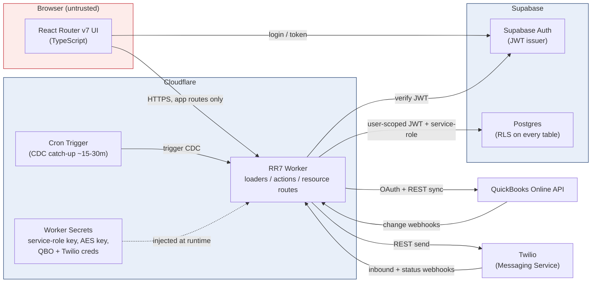
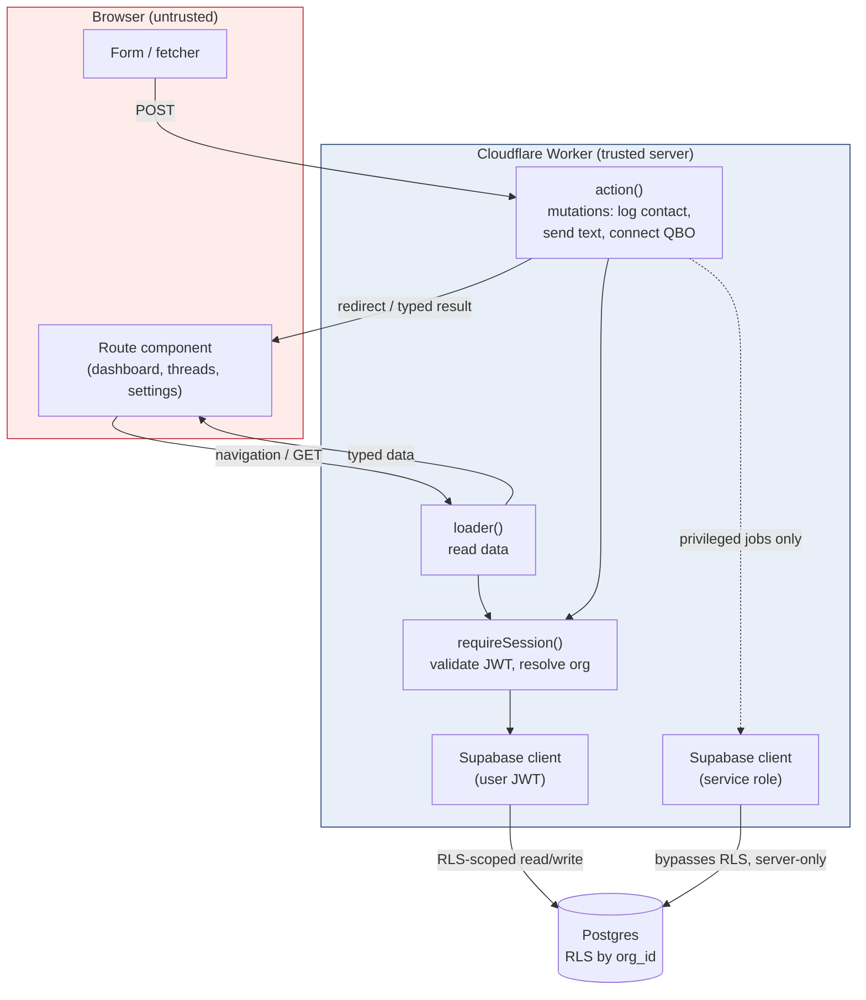
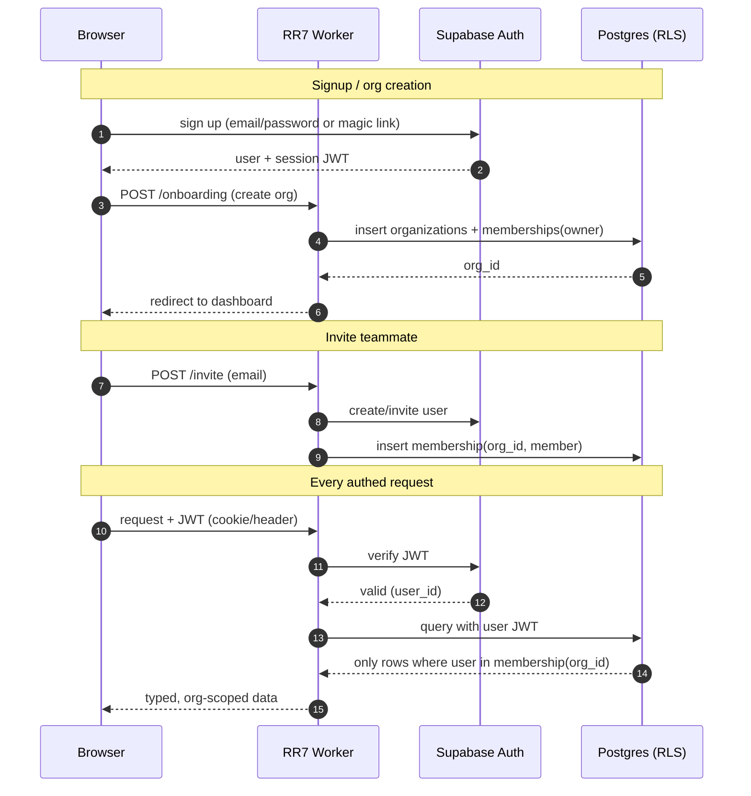
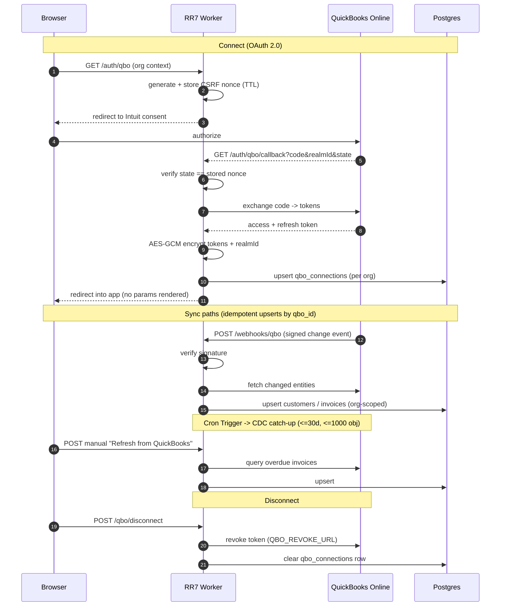
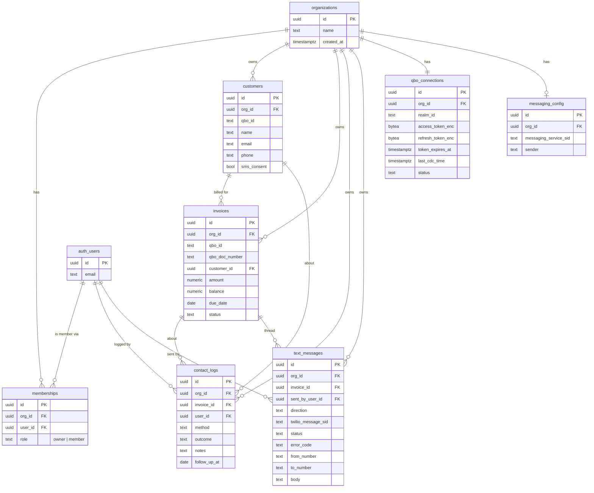

# NudgePay — Architecture Diagrams

**Date:** 2026-06-22
**Companion to:** `2026-06-22-nudgepay-production-rebuild-design.md`
**Format:** Mermaid (renders on GitHub and most Markdown viewers)

These diagrams show expected dataflow, the auth model, the trust boundary, and
the backend QBO/Twilio integrations for the rebuilt NudgePay. The core security
invariant across all of them: **the browser only talks to the app's own server
routes; it never holds the Supabase service-role key and never calls
QBO/Twilio/Supabase-admin directly.**

---

## 1. System Topology / Deployment

How the deployed pieces relate. One Cloudflare Worker runs the whole React
Router v7 app (UI + server loaders/actions + resource routes). Supabase holds
identity and data. QBO and Twilio are external; they both call *in* (webhooks)
and get called *out* (REST).



---

## 2. Frontend Architecture & Dataflow

The browser renders RR7 route components. Data is loaded/mutated via **server**
loaders and actions that execute **inside the Worker** — that server step is the
trust boundary. Normal data access uses a **user-scoped** Supabase client
(carrying the logged-in user's JWT), so Postgres RLS scopes every row to the
user's org. The service-role client is reachable only from privileged server
code paths (sync, webhooks, token storage), never from a browser request.



---

## 3. Auth & Multi-Tenant Access (RLS)

Signup creates a user (Supabase Auth), then an org, then a membership linking
them. The JWT issued on login is presented on every subsequent server request;
the Worker validates it and uses it for a user-scoped Supabase client, so RLS
policies filter every query to rows whose `org_id` the user belongs to.



---

## 4. Backend — QuickBooks OAuth & Sync

OAuth connect uses a real CSRF nonce and a redirecting callback (no HTML, no
leaked params). Tokens are AES-GCM encrypted before storage, per org. Sync is
webhook-primary with a bounded CDC catch-up on a cron, plus a manual refresh —
all writing idempotent upserts.



---

## 5. Backend — Twilio SMS

Outbound texts send via the org's messaging config (or the shared platform
sender), recording the Twilio SID. Inbound replies and delivery/status callbacks
arrive as signature-verified webhooks and update the per-invoice thread. STOP/HELP
opt-out is honored via the Messaging Service.

```mermaid
sequenceDiagram
    autonumber
    participant B as Browser
    participant W as RR7 Worker
    participant T as Twilio
    participant C as Customer phone
    participant DB as Postgres

    Note over B,DB: Outbound
    B->>W: POST /api/text/send (authed, invoice thread)
    W->>W: check sms_consent
    W->>T: send via Messaging Service
    T-->>W: message SID (queued)
    W->>DB: insert text_messages (sid, status, sent_by_user_id, org_id)
    T->>C: SMS delivered

    Note over T,DB: Status callbacks
    T->>W: POST /webhooks/twilio/status (signed)
    W->>DB: update status / error_code by SID

    Note over C,DB: Inbound reply
    C->>T: reply (or STOP / HELP)
    T->>W: POST /webhooks/twilio/inbound (signed)
    W->>W: verify signature; STOP -> set opt-out
    W->>DB: insert inbound text_messages, match to thread
    W-->>B: reply appears in iMessage-style UI
```

---

## 6. Multi-Tenant Data Model

`organizations` is the tenant root; `memberships` links Supabase Auth users to
orgs. Every domain table carries `org_id` and is governed by RLS. `qbo_connections`
(per org) replaces the old single-row `qbo_sync_state`; `messaging_config` (per
org) enables future per-tenant Twilio senders.


